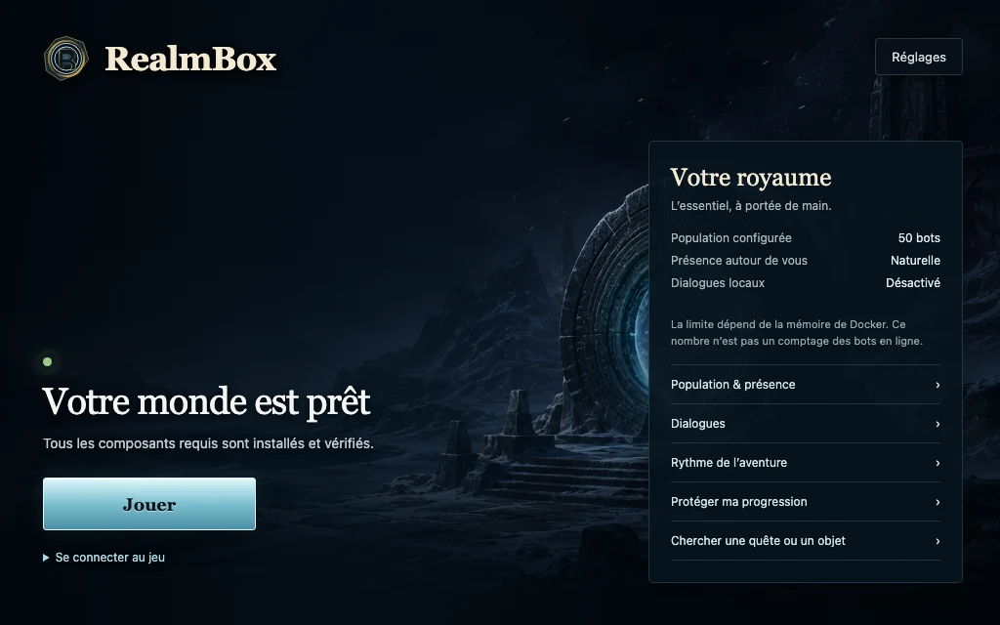

# RealmBox

**World of Warcraft. Azeroth sur votre ordinateur. Des bots inclus.**

[Site web](https://bnjdpn.github.io/RealmBox/fr/) · [Releases](https://github.com/bnjdpn/RealmBox/releases) · [Installation](docs/INSTALLATION.md) · [English](README.md)

RealmBox est un launcher desktop libre pour jouer à World of Warcraft entièrement en local. Donnez-lui le dossier `Data` d’un client WoW compatible : il prépare un royaume AzerothCore privé, peuple Azeroth avec Playerbots, lance le jeu et supervise tout le runtime local.



*Interface RealmBox 0.5.0, capturée avec des données de démonstration.*

## Nouveautés de la version 0.5.0

- **Installation guidée :** choisissez votre copie de WoW, configurez vos compagnons, puis consultez le récapitulatif. Les vérifications Docker et disque doivent réussir avant le téléchargement.
- **Raccourcis du royaume :** ouvrez les compagnons, les dialogues, les profils solo, Protection et le Guide local depuis l’accueil. La population affichée est celle configurée, pas un compteur de joueurs en ligne.
- **Rythme de l’aventure :** choisissez Normal, Confort ou Accéléré, avec un aperçu exact et un retour aux règles précédentes.
- **Recherche locale de quêtes et d’objets :** interrogez le catalogue existant du monde par nom, avec huit résultats maximum et leur source, sans IA ni accès aux personnages.
- **Préréglages d’escouade :** trois équipes à cinq, un compagnon principal observé, une portée groupe/cible explicite et un aperçu des commandes.
- **Reprise du runtime :** protection contre deux instances simultanées et correctif de reprise bornée des dialogues après échec ; ce dernier nécessite les nouvelles images serveur.

**Disponibilité vérifiée le 4 septembre 2026 :** [la préversion 0.5.0 est publique](https://github.com/bnjdpn/RealmBox/releases/tag/v0.5.0), sans installateur joint au moment de cette mise à jour. Consultez cette page pour les fichiers actuels et `SHA256SUMS.txt` avant d’installer. Le parcours complet 0.5.0 reste à qualifier sur les deux plateformes ; Windows reste expérimental. Voir [les preuves de validation](STATUS.md) pour distinguer tests automatisés, builds et jeu réel.

## Ce que fournit le projet

- une seule application orientée joueur pour installer, lancer, arrêter, configurer et diagnostiquer ;
- un assistant en trois étapes avec vérification avant téléchargement, et les raccourcis du royaume sur l’accueil ;
- un serveur d’authentification et un monde AzerothCore locaux avec MySQL ;
- des Playerbots autonomes avec des réglages séparés de population et de proximité, ainsi qu’une équipe de compagnons contrôlable en jeu ;
- OpenWoW géré sur macOS Apple Silicon, ainsi que `Wow.exe` ou OpenWoW sur Windows x64 ;
- des dialogues locaux facultatifs et bornés, avec les modes Direct, Immersif et Vivant via un runtime Ollama géré par RealmBox ;
- trois profils de progression solo réversibles avec aperçu exact, reprise durable et aucune réécriture des personnages ;
- une recherche explicite de quête ou d’objet dans le catalogue local existant, sans IA ni service externe ;
- une installation atomique, des images serveur immuables, des personnages persistants et des sauvegardes complètes vérifiées, automatiques avant migration ou créées à la demande.

RealmBox ne contient aucun client World of Warcraft, MPQ, carte extraite, identifiant, base de personnages ni autre donnée propriétaire du jeu. Ces fichiers proviennent de la copie compatible du joueur et restent en local.

## Architecture

Les installateurs de release attendent les images serveur reconstruites depuis le commit exact de la release et embarquent leurs empreintes immuables, sans réutiliser les variables d’images du dépôt. Voir [la construction et la provenance](docs/BUILDING.md).

```text
React 19 + TypeScript
        │ commandes Tauri étroites
        ▼
LauncherService Rust ── interfaces typées de plateforme et de runtime
        ├── OpenWoW ou Wow.exe appartenant au joueur
        ├── extraction locale depuis le dossier Data monté en lecture seule
        ├── projet Docker Compose : realmbox-v3
        │     ├── MySQL
        │     ├── AzerothCore authserver
        │     ├── AzerothCore worldserver + mod-playerbots
        │     └── outils d’import SQL et d’extraction
        ├── addon RealmBox Compagnons
        └── processus Ollama local facultatif
```

L’interface React ne pilote jamais directement les processus, Docker ou les secrets. Tauri expose une surface de commandes réduite adossée à `LauncherService` ; les effets de plateforme et de runtime passent par des interfaces typées remplaçables par des fakes dans les tests macOS.

Le cycle normal est le suivant :

```text
choisir Data → valider les MPQ → préparer le runtime → extraire localement
→ importer les bases → publier l’installation atomiquement → Jouer
→ démarrer les services → lancer WoW → fermeture du client supervisé
→ arrêter les services sans supprimer les volumes
```

Les images serveur et les révisions des dépendances tierces sont épinglées dans [`third-party.lock.toml`](third-party.lock.toml). Le manifeste d’installation n’est publié qu’après vérification de chaque composant requis.

## Client de jeu

RealmBox accepte la racine du client ou son dossier `Data`. La cible de compatibilité technique est WoW 3.3.5a build 12340 : le launcher vérifie les MPQ attendus, détecte la locale et laisse les extracteurs AzerothCore confirmer la build exacte. Cet identifiant décrit une contrainte de compatibilité du client, pas le produit.

ChromieCraft propose des pages de téléchargement dans les deux langues :

- [Client et téléchargements en français](https://chromiecraft.com/fr/telechargements/)
- [English client and downloads](https://chromiecraft.com/en/downloads/)

Choisissez le client ou le pack de langue proposé sur la page souhaitée. RealmBox utilise ensuite la locale réellement présente dans `Data`. Sur Mac Apple Silicon, le package Windows téléchargé fournit les données du jeu et RealmBox lance OpenWoW natif géré. Sur Windows x64, le `Wow.exe` du joueur est le chemin privilégié lorsqu’il est présent ; OpenWoW géré reste disponible en option.

## Configuration requise

- Mac Apple Silicon ou PC Windows x64 (expérimental) ;
- [Docker Desktop](https://www.docker.com/products/docker-desktop/) installé et démarré ;
- au moins 24 Gio d’espace disque libre, plus la taille du modèle de dialogue local facultatif ;
- un dossier `Data` WoW complet et compatible ;
- une connexion Internet pour la première installation.

La limite de bots dépend de la mémoire attribuée à Docker, pas de la mémoire totale de l’ordinateur :

| Mémoire Docker | Bots autonomes maximum |
| --- | ---: |
| Moins de 12 Gio | 5 |
| 12 à 19 Gio | 50 |
| 20 à 27 Gio | 100 |
| 28 Gio ou plus | 150 |

## Expérience des bots

RealmBox ne déduit aucun choix de bot à partir d’un autre. La dimension du monde contient deux réglages séparés — population et présence — et reste indépendante du comportement de l’équipe en jeu comme des dialogues locaux.

| Réglage | Choix | Effet |
| --- | --- | --- |
| Population | **5**, **25**, **50**, **100** ou **150** | Définit combien d’aventuriers autonomes sont demandés dans le monde ; RealmBox applique toujours le plafond sûr lié à la mémoire Docker. |
| Présence | **Dispersés**, **Naturelle** (recommandé) ou **Toujours proches** | Laisse les déplacements natifs de Playerbots agir seuls, fait passer une population plus légère dans la zone du joueur ou demande une cible plus dense à proximité. |
| Équipe en jeu | **Escorte**, **Garde** ou **Libres** | S’applique uniquement aux quatre compagnons pilotés par l’addon : suivre, tenir la position ou reprendre leurs activités autonomes. |
| Discussion | **Direct**, **Immersif** ou **Vivant** | Autorise seulement les réponses demandées par le joueur, quelques échanges contextuels ou des conversations plus présentes mais toujours bornées. |

Une installation neuve démarre avec la présence **Naturelle**. Une installation antérieure à 0.4.0 sans préférence de présence enregistrée démarre avec **Toujours proches**, afin de conserver son ancien comportement dense jusqu’à ce que le joueur le change. La population et la présence peuvent être appliquées pendant que le worldserver géré tourne ; sinon elles sont enregistrées pour la prochaine partie.

Les messages joueur éligibles ont une chance de réponse configurée à 100 %, passent devant le travail ambiant déjà en file et disposent d’un emplacement que ce bavardage ne peut pas occuper. Cela réduit le risque d’attente sans garantir une réponse : une file déjà remplie de demandes joueur, un échec du modèle local ou la disparition de la destination peuvent encore empêcher l’envoi. Les budgets ambiants de groupe et de raid sont isolés par groupe, avec un plafond global partagé entre les échanges ambiants. Les demandes joueur éligibles contournent ce gouverneur ambiant, mais pas la file, le modèle ni la validation de la destination.

Les trois modes ne conservent ni historique de discussion, ni mémoire ou relation évolutive, et n’utilisent ni RAG ni emotes générées. Pour une réponse directe, le prompt demande au modèle de répondre dans la langue du dernier message joueur. Les échanges ambiants utilisent des prompts français avec une copie `frFR` et anglais avec les autres locales prises en charge ; ce choix automatisé n’a pas encore été qualifié dans OpenWoW.

L’arbre source courant ajoute aussi des préréglages d’escouade à cinq, un compagnon principal observé, une portée groupe/cible explicite et l’aperçu de chaque commande bornée. Il n’expulse jamais un membre du groupe. Les noms mémorisés sont des observations, pas une preuve d’identité bot : RealmBox ne promet donc pas de rappeler exactement les mêmes bots sans contrat serveur typé et atomique. Voir [le contrat de l’addon](docs/COMPANION_ADDON.md).

## Progression solo et Guide local

| Profil | Expérience et réputation | Argent ramassé | Professions primaires |
| --- | --- | --- | --- |
| Normal | ×1 | ×1 | 2 |
| Confort | ×2 | ×1 | 11 |
| Accéléré | ×3 | ×2 | 11 |

Confort et Accéléré assouplissent aussi les prérequis de niveau en instance et de groupe en raid, et autorisent les quêtes normales en raid. Appliquez les changements monde arrêté, après avoir consulté les valeurs exactes. Revenir aux règles précédentes ne retire pas les récompenses ou métiers déjà acquis. La difficulté des ennemis ne change pas.

Le Guide local recherche les noms de quêtes ou d’objets dans le catalogue existant du monde. Il ne lit ni l’inventaire ni le journal de quêtes et ne propose pas de conseil de progression personnalisé. Les résultats indiquent leur source et signalent les informations partielles ou indisponibles.

Ces fonctions sont incluses dans la source 0.5.0 ; leur parcours en jeu reste à qualifier. Voir [les valeurs exactes, la reprise et les limites](docs/SOLO_PROFILES_AND_LOCAL_GUIDE.md).

## Installation

1. Installez et démarrez [Docker Desktop](https://www.docker.com/products/docker-desktop/).
2. Téléchargez les données WoW compatibles depuis la page ChromieCraft [française](https://chromiecraft.com/fr/telechargements/) ou [anglaise](https://chromiecraft.com/en/downloads/).
3. Consultez les [fichiers de la préversion 0.5.0](https://github.com/bnjdpn/RealmBox/releases/tag/v0.5.0). Une fois l’installateur de votre plateforme et `SHA256SUMS.txt` disponibles, téléchargez-les et comparez la somme de contrôle.
4. Dans **Votre copie de WoW**, sélectionnez le dossier du jeu ou `Data` ; l’aide au téléchargement est disponible dans cette même vue.
5. Choisissez **Vos compagnons**, puis consultez **Votre installation**. Corrigez les avertissements de préparation avant de cliquer sur **Installer**.
6. Cliquez sur **Jouer** lorsque RealmBox indique qu’Azeroth est prêt.

La signature de distribution et la notarisation ne sont pas fournies. Ne contournez pas un avertissement du système si le SHA-256 de l’artefact téléchargé ne correspond pas exactement à la somme publiée. Le [guide d’installation complet](docs/INSTALLATION.md) détaille chaque plateforme.

Ces étapes décrivent l’assistant 0.5.0. Vérifiez la note de disponibilité ci-dessus avant de télécharger. Voir [le contrat UX et de sécurité](docs/SETUP_EXPERIENCE.md).

## Persistance et sécurité des mises à jour

Le projet Docker Compose se nomme définitivement `realmbox-v3` ; ce n’est pas un numéro de version de l’application. Sa stabilité permet de retrouver le volume de la base joueurs après chaque release.

Avant la première migration exécutée par chaque version desktop, RealmBox :

1. exporte toutes les bases MySQL attendues dans un dump cohérent ;
2. vérifie le contenu du dump et son SHA-256 ;
3. stocke la sauvegarde hors du runtime remplaçable sans écraser une sauvegarde existante ;
4. applique la migration ;
5. n’avance le marqueur de version migrée qu’après réussite.

Après installation, **Réglages → Protection** permet aussi de créer un nouveau point complet et vérifié à la demande. Si le monde est ouvert, RealmBox réalise la copie cohérente sans l’arrêter. S’il est fermé, RealmBox démarre uniquement la base de données puis la remet à l’arrêt. Ces points restent hors du runtime remplaçable, ne sont jamais écrasés et peuvent servir à la récupération après une purge Docker.

Un schéma d’installation inconnu, une sauvegarde incomplète ou une migration en échec bloque la mise à jour. Le launcher ne transforme jamais un royaume existant en installation neuve et n’appelle jamais `docker compose down --volumes` ou `-v`.

Si Docker Desktop est purgé en dehors de RealmBox, le launcher détecte les volumes manquants. Au prochain clic sur **Jouer**, il retélécharge les images immuables, reconstruit les ressources serveur et restaure la sauvegarde joueurs complète et vérifiée la plus récente avant les migrations. Sans sauvegarde valide, il s’arrête au lieu de créer silencieusement un royaume vide.

## Organisation du dépôt

| Chemin | Rôle |
| --- | --- |
| `apps/desktop/` | Interface React et application desktop Tauri |
| `apps/desktop/src-tauri/` | Machine à états Rust et intégrations plateforme/runtime |
| `addons/RealmBoxCompanions/` | Contrôle des compagnons en jeu |
| `runtime/` | Templates Compose, manifestes et helpers de plateforme |
| `patches/` | Correctifs relus appliqués aux composants upstream épinglés |
| `site/` | Sources Astro du site GitHub Pages bilingue |
| `scripts/` | Outils de release, captures, manifestes et validation |
| `tools/xtask/` | Vérification des invariants du dépôt et des releases |
| `docs/` | Architecture, installation, compatibilité, sécurité et exploitation |

## Développement

Le workspace utilise pnpm, Node.js, Rust et Tauri. Docker Desktop est nécessaire pour le parcours local réel.

```sh
pnpm install
pnpm dev:preview   # interface React avec runtime simulé
pnpm dev           # application desktop Tauri
pnpm site:dev      # site GitHub Pages
pnpm verify        # UI, scripts, builds, site, Rust et invariants de release
```

Commandes ciblées utiles :

```sh
pnpm typecheck
pnpm test
pnpm test:guide-sql # preuve MySQL isolée, jamais sur la base du joueur
pnpm site:build
cargo test --workspace
cargo xtask release check
```

## Documentation technique

- [Architecture](docs/ARCHITECTURE.md)
- [Installation](docs/INSTALLATION.md)
- [Installation guidée et accueil](docs/SETUP_EXPERIENCE.md)
- [Changelog](CHANGELOG.md) et [état des validations](STATUS.md)
- [Compatibilité](docs/COMPATIBILITY.md)
- [Mises à jour et sauvegardes](docs/UPDATES.md)
- [Sécurité](docs/SECURITY.md)
- [Compilation](docs/BUILDING.md)
- [Dépannage](docs/TROUBLESHOOTING.md)
- [Population, présence et comportement Playerbots](docs/PLAYERBOTS_INTEGRATION.md)
- [Dialogues locaux](docs/OLLAMA_CHAT_INTEGRATION.md)
- [Profils solo et guide local](docs/SOLO_PROFILES_AND_LOCAL_GUIDE.md)
- [Addon Compagnons et commandes bornées](docs/COMPANION_ADDON.md)
- [Revue des projets solo et bots étudiés](docs/ECOSYSTEM_REVIEW_2026-09-03.md)
- [Distribution et licences](docs/LEGAL_AND_DISTRIBUTION.md)

## Licence et indépendance

RealmBox est distribué sous [AGPL-3.0-only](LICENSE). C’est un projet indépendant, sans affiliation ni approbation de Blizzard Entertainment ou de ChromieCraft. World of Warcraft, Azeroth et les noms associés appartiennent à leurs ayants droit respectifs.
